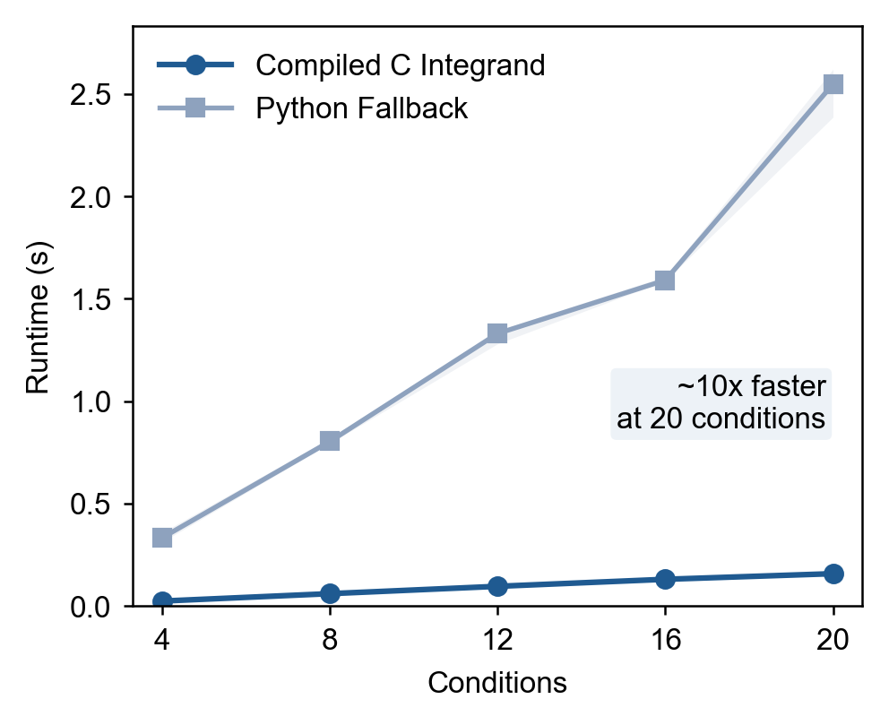
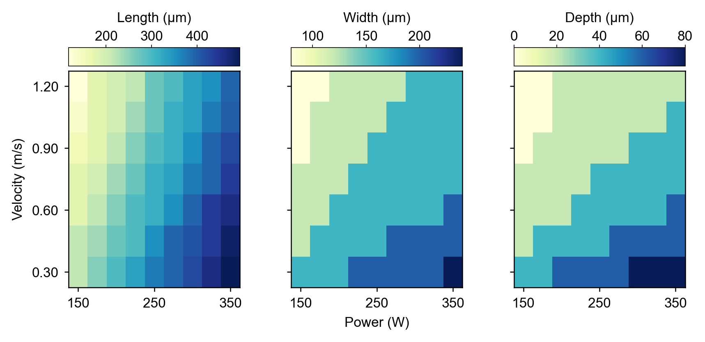

# Methodology

## Background

The Eagar–Tsai model (1983) provides an analytical solution for the steady-state temperature field produced by a Gaussian laser beam moving at constant velocity over a semi-infinite solid. It is widely used in additive manufacturing and laser welding research to estimate melt pool geometry without the cost of full finite-element simulations.

**References:**

- T. W. Eagar and N.-S. Tsai, "Temperature Fields Produced by Traveling Distributed Heat Sources," *Welding Journal (Research Supplement)*, December 1983, pp. 346-s–354-s.
- C integrand reformulation: Sasha Rubenchik, LLNL, 2015.

---

## Assumptions

- Semi-infinite solid (no boundaries other than the top surface).
- Constant material properties evaluated at the liquidus temperature.
- Gaussian heat source with constant absorptivity.
- Steady-state moving source (the temperature field moves with the beam).
- No melt flow, vaporization, or latent heat effects.

---

## Governing Equations

### Thermal diffusivity

Material thermal diffusivity is computed from the three input properties:

$$
\alpha = \frac{k}{\rho\, c_p}
$$

where $k$ is thermal conductivity (W/(m·K)), $\rho$ is density (kg/m³), and $c_p$ is specific heat (J/(kg·K)).

### Non-dimensional parameter

The model uses a single non-dimensional parameter that captures the ratio of diffusive to advective transport:

$$
p = \frac{\alpha}{v\,\sigma}
$$

where $v$ is the scan velocity (m/s) and $\sigma$ is the Gaussian beam width derived from beam diameter $d$:

$$
\sigma = \frac{\sqrt{2}\,d}{2}
$$

Large $p$ characterizes diffusion-dominated conditions; small $p$ characterizes advection-dominated ones.

### Temperature prefactor

The overall temperature scale is set by:

$$
T_s = \frac{A\,P}{\pi\,\rho\,c_p\,\sqrt{\pi\,\alpha\,v\,\sigma^3}}
$$

where $A$ is absorptivity (dimensionless) and $P$ is laser power (W). Using $k/\alpha = \rho c_p$, this is equivalent to the form $T_s = A P \alpha / (\pi k \sqrt{\pi \alpha v \sigma^3})$.

### Temperature field

The temperature at any point $(x, y, z)$ in the frame co-moving with the beam is:

$$
T(x,\,y,\,z) = T_0 + T_s \int_0^\infty f(t;\;x,\,y,\,z,\,p)\,\mathrm{d}t
$$

where $T_0 = 298\,\mathrm{K}$ is the ambient temperature and $t$ is a dimensionless time-like integration variable (not physical time). All spatial coordinates $(x, y, z)$ are non-dimensionality by $\sigma$.

### Integrand

$$
f(t;\;x,\,y,\,z,\,p) = \frac{1}{(4pt+1)\,\sqrt{t}}\exp\!\left(-\frac{z^2}{4t} - \frac{y^2 + (x-t)^2}{4pt+1}\right)
$$

!!! note "Singularity at $t = 0$"
    The $1/\sqrt{t}$ factor produces an integrable singularity at $t = 0$. SciPy's `quad` (adaptive QUADPACK) handles this automatically without any regularization. For performance, the integrand is implemented as a C extension (`_integrand_ext.c`) and passed to QUADPACK as a `LowLevelCallable`, eliminating Python overhead on every function evaluation.

### C extension performance

The compiled integrand is roughly an order of magnitude faster than the pure-Python fallback. The figure below shows median wall-clock time across repeated runs for both modes as the number of conditions grows.

<figure markdown="span" style="width: 100%; display: block; text-align: center;">
    { width="400" }
    <figcaption style="display: block; width: 100%; max-width: 100%;">Runtime comparison between the compiled C integrand and the pure-Python fallback for serial single-worker execution. Shaded bands show the min–max range over repeated runs. Conditions: 316L stainless steel, P = 150–350 W, v = 0.30–1.20 m/s.</figcaption>
</figure>

---

## Melt Pool Extraction

The temperature field is evaluated on two planes:

- the **x–y plane** (z = 0, top surface) to get melt pool length and half-width,
- the **x–z plane** (y = 0, centerline) to get melt pool depth.

The melt pool boundary is the liquidus isotherm $T = T_\mathrm{liq}$. The three dimensions are extracted as:

| Dimension | Definition                                                                 |
|-----------|----------------------------------------------------------------------------|
| Length    | Extent of $T \geq T_\mathrm{liq}$ along $x$                                |
| Width     | $2 \times$ half-extent of $T \geq T_\mathrm{liq}$ along $y$ at the surface |
| Depth     | Extent of $T \geq T_\mathrm{liq}$ along $z$ at the centerline              |

If the melt pool reaches any domain boundary, the domain is automatically expanded and the computation is repeated (up to 20 iterations).

The figure below shows how melt pool length, width, and depth vary across a laser power–scan speed grid for 316L stainless steel, illustrating the expected monotonic trends with power and the non-linear response with scan speed.

<figure markdown="span" style="width: 100%; display: block; text-align: center;">
    { width="600" }
    <figcaption style="display: block; width: 100%; max-width: 100%;">Melt pool length, width, and depth as a function of laser power and scan velocity for 316L stainless steel (Tliq = 1700 K, k = 30 W/(m·K), ρ = 7800 kg/m³, cp = 700 J/(kg·K)). Beam parameters: d = 100 µm, A = 0.35. Grid: P = 150–350 W in 25 W steps (9 points), v = 0.30–1.20 m/s in 0.15 m/s steps (7 points).</figcaption>
</figure>
